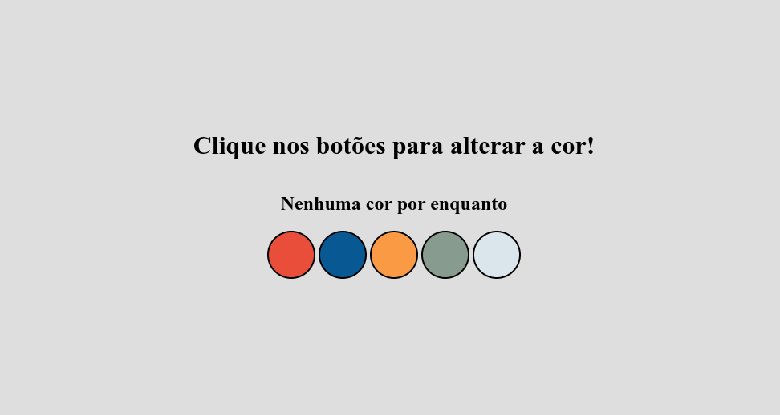
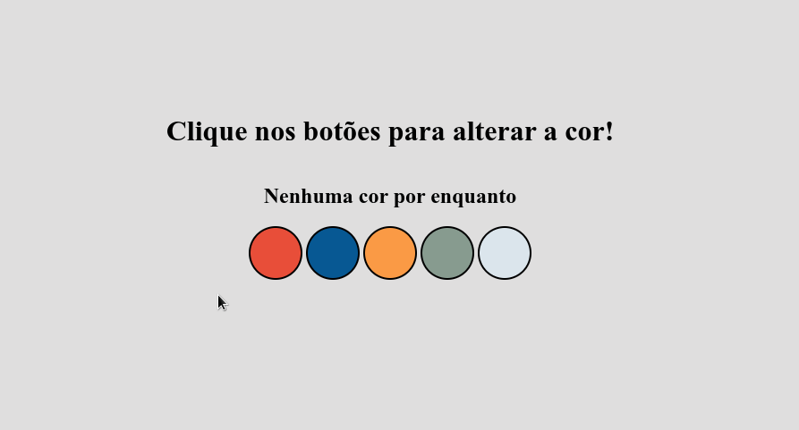

# Altera Fundo
**Obs: O repositório original foi deletado depois da gravação do curso, portanto os shields e o vídeo podem não ser mostrados da maneira correta.** 

</img>
</img>

http://user-images.githubusercontent.com/48692595/171265841-27cd8c97-502f-4a95-829dbe064b60362b.mp4

## 🤔 O que é este projeto
Este projeto é uma página feita com HTML, CSS e Javascript que contém uma série de botões coloridos para que a pessoa que está utilizando a aplicação possa alterar a cor de fundo da página.

## 🖥️ Como rodar este projeto
Para rodar o projeto basta dar dois cliques no arquivo *index.html* uma vez que a pasta do projeto esteja aberta no sistema de arquivos do seu sistema operacional.

Alternativamente você também pode utilizar a extensão [Live Server](https://marketplace.visualstudio.com/items?itemName=ritwickdey.LiveServer) da IDE Visual Studio Code para rodar o projeto.

## 🕹️ Como usar este projeto
Uma vez que a aplicação esteja rodando, você pode clicar nos círculos coloridos que são mostrados na página para alterar a cor de fundo da página. A cor será alterada de acordo com o botão que você pressionar.

## ⚙️ Tecnologias usadas no projeto
- 
- 
- 

## 🗒️ Features do projeto
- 5 botões com cores diferentes que alteram a cor de fundo da página
- Subtítulo que é atualizado conforme a cor atual da página

## 🗂️ Como este projeto está organizado
Na pasta raiz do projeto existem três arquivos de código:
- index.html -> contém o html da aplicação
- style.css -> contém os estilos da aplicação
- script.js -> contém o código javascript da aplicação

## 👩‍💻 Como este projeto foi implementado
Este projeto foi implementado com HTML, CSS e JavaScript.

No javascript os botões definidos no HTML são capturados através de um getElementsByTagName e é adicionado um event listener a cada um desses botões.

Ao clicar em um botão, é disparado um evento que irá alterar a cor de fundo da página e o título de segunda importância será atualizado com o código da cor, que está armazenado em um array.

## ⭐ Dependências principais
Não temos dependências no projeto.

## 💎 Links úteis
- [Paleta de cores](https://coolors.co/palette/d94e33-2c5697-ed9b33-8a9b8e-2d2926-f4e5de-dde5ed-f8f1e0-d7d2cb-dfdede)

## 🤝 Como contribuir com o projeto
[Clique aqui](./CONTRIBUTING.md) para ver as diretrizes de contribuição.

## 👩‍💻 Pessoas que contribuiram com o projeto
- [Letícia](https://github.com/LelePG) - mantenedora do projeto
- [Letícia2](https://github.com/LelePG) - contribuinte
- [Letícia3](https://github.com/LelePG) - contribuinte

## 🆘 Precisa de ajuda?
Você pode contatar a Letícia (mantenedora do projeto) em email@legal.com ou entre em contato pelas redes sociais:

-------

Feito com 🪄 por Letícia

